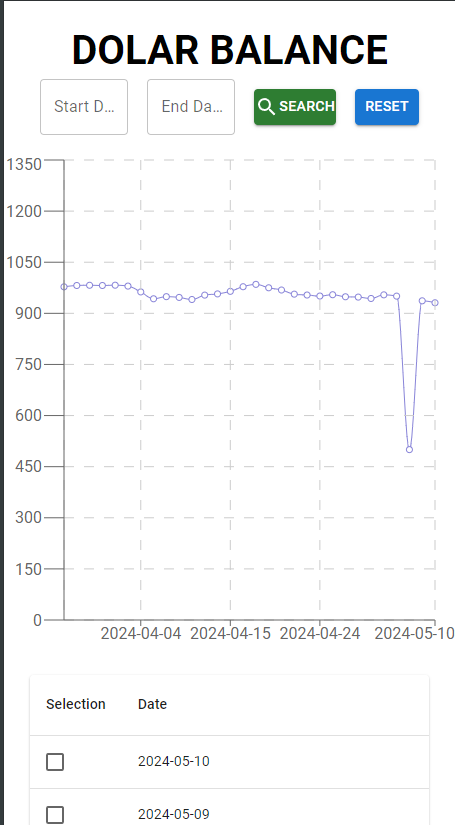
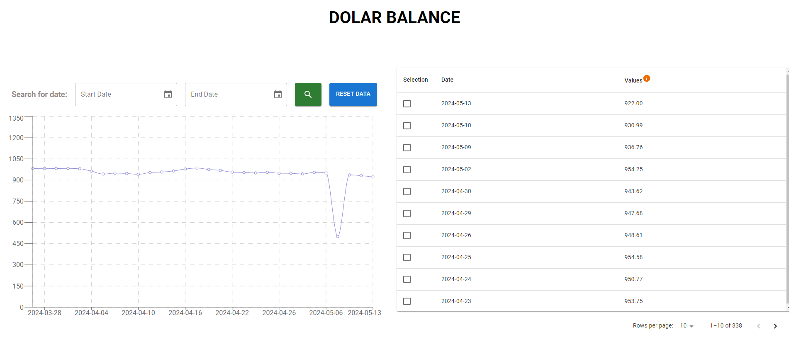

# Front React + TypeScript + Vite | Back Laravel | Base de datos Postgres

- Github: https://github.com/FreelanceHenryCarrillo/dollar-prueba-tecnica
- URL Produccion : https://dollar-prueba-tecnica.netlify.app/
- URL Back produccion : https://dollar-prueba-tecnica-production.up.railway.app

# FRONT

  - Se realizo un diseño basico donde se le dio mas prioridad a las funcionalidades 
  - se realizo el diseño responsive para versiones moviles
  - se realizo 2 inputs para buscar por fechas cubriendo que la data solo llegue al año 2023 y a la actualidad
  - agegamos una multi seleccion creada propiamente sin usar la opcion de MUI para borrar varias celdas
  - agregamos un doble click a lso valores para editar su valor --> tambien un tooltip para mas informacion de la accion
  - agregamos un botton para resetear la data y quitar la busqueda y realizando la accio nde borrar los filtros de fechas
  - Agregamos validacion que deben estar las 2 fechas seleecionadas para poder hacer la busqueda

 **NOTA: No se uso buenas practicas para el CSS ya que me enfoque en la funcionalidades**

- Se adjunta imagen

  # Movil

  # Escritorio

# BACK

- se realizo el comando On-Demand local
command --> php artisan fetch:dollar-value

- tambien se coloco un funcion --> schedule --> que ejecuta cada hora el comando php artisan fetch:dollar-value
- Testeado con el servidor de produccion de railway (cron Job)

Se realizan los siguientes endpoints :
version de produccion:

        METHOD: GET
        URL_ENDPOINT: https://dollar-prueba-tecnica-production.up.railway.app/api/dollar-values
        descripcion: Trae todos los datos que se realizan en el fetch del comando tamibne opcional puede venir por params start_date y end_date para traer los datos con las fechas solicitadas

        METHOD: POST
        URL_ENDPOINT: https://dollar-prueba-tecnica-production.up.railway.app/api/dollar-values
        descripcion: se realiza la insercion en la base de datos el fetch del comando creado para obtener la fluctuacion del dolar

        METHOD: PATCH
        URL_ENDPOINT: https://dollar-prueba-tecnica-production.up.railway.app/api/dollar-values
        descripcion: se realiza para hacer un cambio solo al valor del dolar de la base de datos

        METHOD: POST --> se pudo realizar dentro del PATCH del Update mas adelante lo optimizare
        URL_ENDPOINT: https://dollar-prueba-tecnica-production.up.railway.app/api/dollar-values
        descripcion: se realiza para hacer eliminar multiple registro y aprovechar el Body
